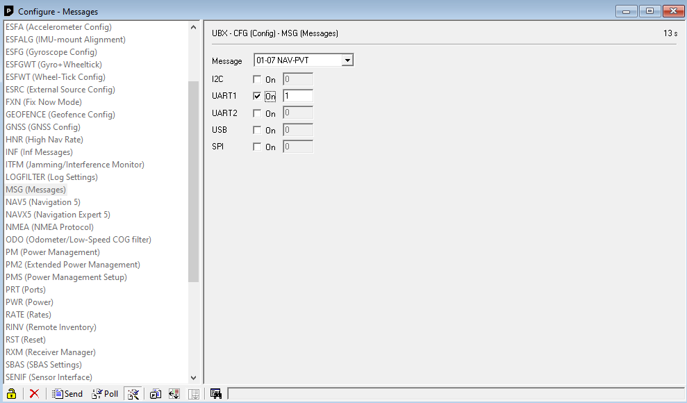
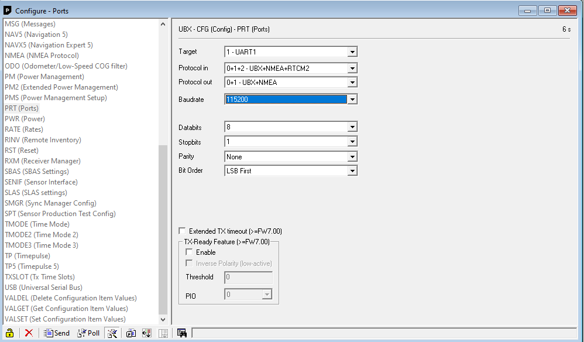
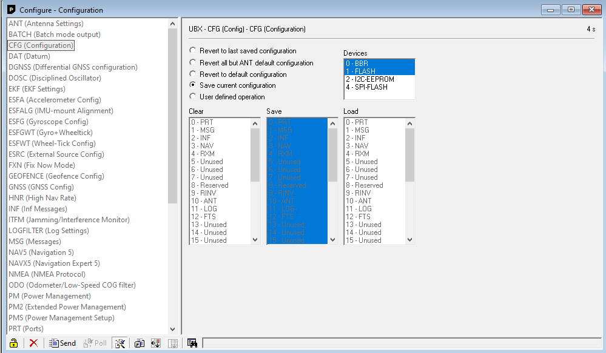
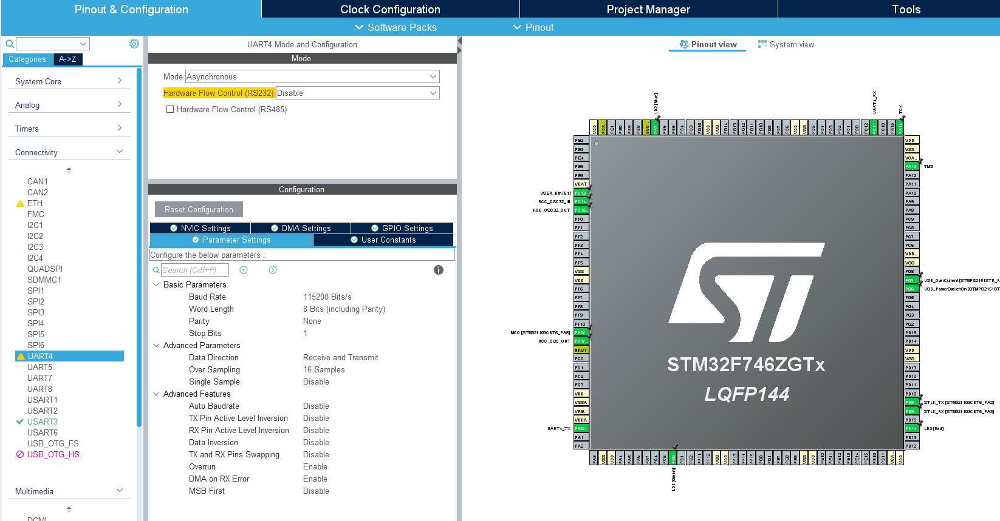
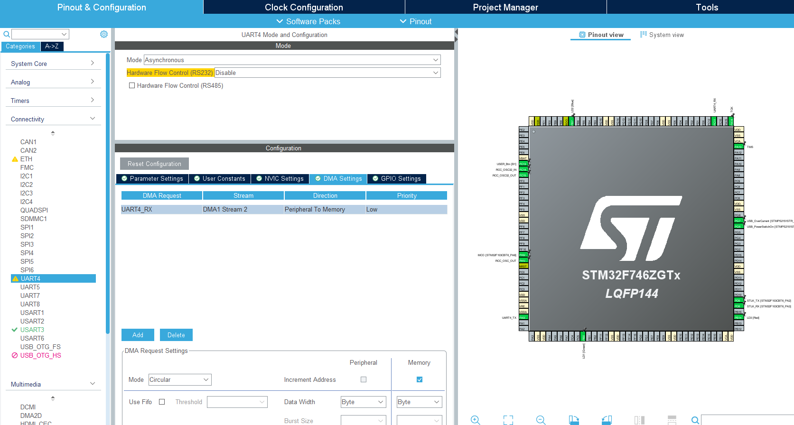
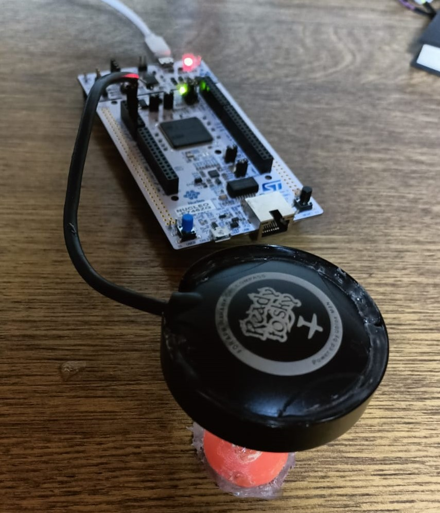

## U-blox - NEO-M8N-0-01 GPS  | STM32 Nucleo Application Series ##

In this project, time and location data were obtained via U-blox NEO-M8N type GPS with STM32. GPS configuration were made via the u-Center application.

The data from the GPS was received over the serial port with a DMA structure. Then, these data were interpreted with the state machine algorithm and converted into location and time data.

**GPS Configuration**

Position and time data via GPS were read from the UBX-NAV-PVT package. And the badurate is set to 115200. All other packages are closed. The following images show the adjustments made via the interface. Also, the configuraston file is given in the ***/config/*** folder.

**Package Setting**

  

**Port Setting**

  

**Save Config**

  

**STM32 Setting**

On the STM side, reading is done with DMA from the UART4 port. Baudrate is set to 115200. The DMA buffer is defined as size cirular. The relevant adjustments are shown in the image:

  

  

**Figure of the System**

  

**Result**

  

